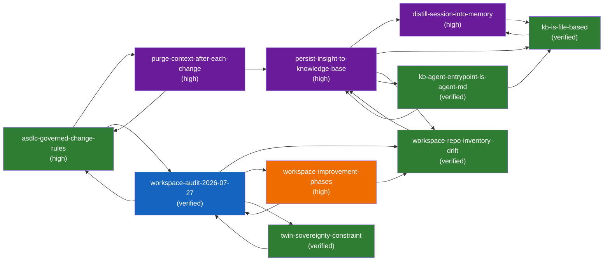

# Memory graph

Auto-generated by `scripts/visualize.py` — do not edit by hand.

```mermaid
flowchart LR
    classDef semantic fill:#2e7d32,color:#fff
    classDef episodic fill:#1565c0,color:#fff
    classDef procedural fill:#6a1b9a,color:#fff
    classDef working fill:#8d6e63,color:#fff
    classDef retrieval fill:#00838f,color:#fff
    classDef parametric fill:#455a64,color:#fff
    classDef prospective fill:#ef6c00,color:#fff
    n_asdlc_governed_change_rules["asdlc-governed-change-rules<br/>(high)"]:::semantic
    n_kb_agent_entrypoint_is_agent_md["kb-agent-entrypoint-is-agent-md<br/>(verified)"]:::semantic
    n_kb_is_file_based["kb-is-file-based<br/>(verified)"]:::semantic
    n_twin_sovereignty_constraint["twin-sovereignty-constraint<br/>(verified)"]:::semantic
    n_workspace_repo_inventory_drift["workspace-repo-inventory-drift<br/>(verified)"]:::semantic
    n_workspace_audit_2026_07_27["workspace-audit-2026-07-27<br/>(verified)"]:::episodic
    n_distill_session_into_memory["distill-session-into-memory<br/>(high)"]:::procedural
    n_persist_insight_to_knowledge_base["persist-insight-to-knowledge-base<br/>(high)"]:::procedural
    n_purge_context_after_each_change["purge-context-after-each-change<br/>(high)"]:::procedural
    n_workspace_improvement_phases["workspace-improvement-phases<br/>(high)"]:::prospective
    n_asdlc_governed_change_rules --> n_purge_context_after_each_change
    n_asdlc_governed_change_rules --> n_workspace_audit_2026_07_27
    n_kb_agent_entrypoint_is_agent_md --> n_kb_is_file_based
    n_kb_agent_entrypoint_is_agent_md --> n_persist_insight_to_knowledge_base
    n_kb_is_file_based --> n_distill_session_into_memory
    n_twin_sovereignty_constraint --> n_workspace_audit_2026_07_27
    n_workspace_repo_inventory_drift --> n_persist_insight_to_knowledge_base
    n_workspace_audit_2026_07_27 --> n_workspace_repo_inventory_drift
    n_workspace_audit_2026_07_27 --> n_workspace_improvement_phases
    n_workspace_audit_2026_07_27 --> n_twin_sovereignty_constraint
    n_workspace_audit_2026_07_27 --> n_asdlc_governed_change_rules
    n_distill_session_into_memory --> n_kb_is_file_based
    n_persist_insight_to_knowledge_base --> n_distill_session_into_memory
    n_persist_insight_to_knowledge_base --> n_kb_is_file_based
    n_persist_insight_to_knowledge_base --> n_workspace_repo_inventory_drift
    n_persist_insight_to_knowledge_base --> n_kb_agent_entrypoint_is_agent_md
    n_purge_context_after_each_change --> n_persist_insight_to_knowledge_base
    n_purge_context_after_each_change --> n_asdlc_governed_change_rules
    n_workspace_improvement_phases --> n_workspace_audit_2026_07_27
    n_workspace_improvement_phases --> n_workspace_repo_inventory_drift
```
