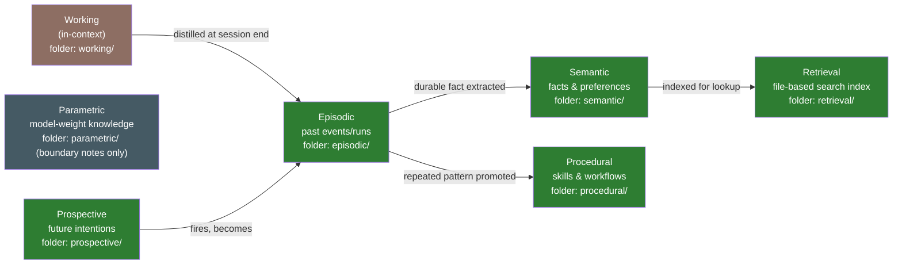

# Agent Memory Knowledge Base

[](https://github.com/jvanheerikhuize/knowledge-base/actions/workflows/kb-lint.yml)

A file-based, infrastructure-free knowledge base built around the [7 types
of agent memory](https://www.marktechpost.com/2026/06/21/the-7-types-of-agent-memory-a-technical-guide-for-ai-engineers/)
(CoALA-derived), following the ingest/wiki/lint maintenance pattern from
[Karpathy's "LLM Wiki" gist](https://gist.github.com/karpathy/442a6bf555914893e9891c11519de94f).
Plain markdown + a stdlib-only Python CLI — no database, no server, no
dependencies.

## The 7 memory types

| Type | Holds | Example |
|------|-------|---------|
| `semantic` | Facts about the world/project | "the KB is file-based, no infra" |
| `episodic` | Records of specific past events | "on 2026-07-22 we migrated X" |
| `procedural` | How-to knowledge, workflows | "how to distill a session into memory" |
| `working` | Short-lived scratch state | current task context |
| `retrieval` | Pointers to external sources | URLs, docs, dashboards |
| `parametric` | Notes on model-internal knowledge | what the agent knows without lookup |
| `prospective` | Future intentions with a `due` date | "rotate the token before 2026-09-01" |

Every entry is one markdown file with YAML frontmatter (name, type,
description, confidence, dates, links). The current contents are always
visible in the auto-generated
[memory graph](.kb/generated/graph.md) and
[index](.kb/generated/index.md).

## Start here

- **Agent entry point:** [`memory/AGENT.md`](memory/AGENT.md) — read this first if
  you're an agent operating on this knowledge base.
- **Design** — see [Architecture](#architecture) and [Design decisions](#design-decisions)
  below for the taxonomy mapping, entry lifecycle, and the rationale behind each
  requirement.

## Layout

```
memory/       the knowledge base itself, one folder per memory type (human-readable)
.kb/          fixed tooling machinery: templates/, schema/, generated/ graph+index, log.md
scripts/      kb.py (CLI), visualize.py (mermaid graph generator), scaffold.sh
tests/        stdlib unittest suites for kb.py and visualize.py
.github/      CI workflow that lints and re-visualizes the KB on every change
```

`memory/` holds only human-readable knowledge — `AGENT.md` plus one folder per
memory type. Everything an editor doesn't need to touch (the entry template, the
JSON Schema, the generated graph/index, the ingest log) lives in `.kb/`. That
directory name is fixed even when the memory folder is scaffolded under a
different name, so the two never get tangled.

## Architecture

```mermaid
flowchart TB
    subgraph Sources["Raw Sources (immutable)"]
        S1[Docs / transcripts]
        S2[Web pages]
        S3[Prior agent sessions]
    end

    subgraph Ingestion["Ingestion Layer"]
        ING["scripts/kb.py new<br/>(agent-assisted classification)"]
    end

    subgraph KB["memory/ — the knowledge base"]
        ENTRY["AGENT.md<br/>(single entry point)"]
        SEM["semantic/"]
        EPI["episodic/"]
        PRO["procedural/"]
        WRK["working/"]
        RET["retrieval/"]
        PAR["parametric/"]
        PRS["prospective/"]
    end

    subgraph Interface["Interaction Interface"]
        CLI["scripts/kb.py<br/>list / search / show / lint"]
    end

    subgraph Viz["Visualization Layer"]
        GEN["scripts/visualize.py"]
        GRAPH[".kb/generated/graph.mmd"]
    end

    subgraph Pipeline["Scaffolder / CI"]
        SCAF["scripts/scaffold.sh"]
        GHA[".github/workflows/kb-lint.yml"]
    end

    Sources --> Ingestion --> KB
    ENTRY -.orients.-> SEM & EPI & PRO & WRK & RET & PAR & PRS
    KB --> CLI
    KB --> GEN --> GRAPH
    GHA --> GEN
    GHA --> CLI
    SCAF -. drops memory/+.kb/+scripts/ into any repo .-> KB
```

### Memory taxonomy → folder mapping

Based on the [CoALA framework](https://arxiv.org/abs/2309.02427) and the
7-types article. Working memory is distilled into durable types before context
is lost; those types feed retrieval; prospective intentions fire into episodes:



`working/` never stores raw context (that would defeat the purpose of a context
window); it holds only the *template* an agent uses to distill a session before
it ends. `parametric/` is documentation-only: it records the explicit boundary
of what the KB assumes any capable model already knows, so entries aren't wasted
re-stating common knowledge.

### Entry lifecycle

```mermaid
sequenceDiagram
    participant Agent
    participant KB as memory/&lt;type&gt;/*.md
    participant Lint as kb.py lint
    participant Viz as visualize.py

    Agent->>KB: kb.py new --type semantic "fact name"
    Note over KB: writes frontmatter:<br/>confidence, source, last_verified, links
    Agent->>KB: fills in content, sets confidence
    Agent->>Lint: kb.py lint
    Lint-->>Agent: flags stale (>90d unverified),<br/>duplicate slugs, dangling links, schema violations
    Agent->>KB: resolves flags, updates last_verified
    Agent->>Viz: scripts/visualize.py
    Viz->>KB: reads all frontmatter
    Viz-->>KB: writes .kb/generated/graph.mmd
```

## Design decisions

| Requirement | Decision |
|---|---|
| Human readable/editable | Markdown files, YAML frontmatter, no binary formats; machinery kept out of `memory/` in `.kb/` |
| Agent/solution-agnostic single entry point | `memory/AGENT.md` — any agent reads this first, regardless of framework (mirrors the emerging `AGENTS.md` convention) |
| No infra | No DB/vector store. "Retrieval memory" is plain markdown + keyword search over frontmatter, not embeddings |
| Industry-standard alignment | CoALA memory taxonomy + `AGENTS.md` convention + frontmatter style used by Jekyll/Obsidian tooling; maintenance follows Karpathy's LLM-wiki pattern (immutable sources, an incrementally curated linked layer, periodic lint) |
| Ingestion layer | `scripts/kb.py new` scaffolds a typed entry from a template; the operating agent (not a bespoke model call) does the classification, keeping the system model-agnostic |
| Visualization layer | `scripts/visualize.py` walks frontmatter `links:` and emits a Mermaid graph + index, colored by memory type |
| Interaction interface | `scripts/kb.py` CLI: `list`, `search`, `show`, `new`, `lint` |
| Fact-checking / confidence | Every entry carries `confidence` (verified/high/medium/low/unverified) + `last_verified`; `kb.py lint` flags stale entries, duplicate slugs, dangling links, and schema violations |
| Scaffolding via pipeline/action | `scripts/scaffold.sh` copies `memory/` + `.kb/` + `scripts/` into a target repo; `.github/workflows/kb-lint.yml` shows the CI trigger pattern |

**Deliberate non-goals (v1):** no embeddings/vector search (grep-based
retrieval is the trade-off that keeps "no infra" true); no hardcoded
LLM-driven classification pipeline (ingestion is agent-assisted); no UI server
for visualization (Mermaid renders natively in GitHub, IDEs, and Claude
artifacts). No content-level contradiction checker exists yet — lint detects
duplicate slugs, not conflicting claims.

## CLI quickstart

```
python3 scripts/kb.py list
python3 scripts/kb.py search "<keyword>"
python3 scripts/kb.py new --type semantic "<name>"
python3 scripts/kb.py new --type prospective "<name>" --due 2026-12-31
python3 scripts/kb.py lint
python3 scripts/visualize.py
```

`kb.py lint` enforces the frontmatter schema, catches duplicate slugs and
dangling links, and warns on stale, unverified, orphaned, or overdue
entries (`--strict` turns warnings fatal; CI runs that weekly).

## Tests

```
python3 -m unittest discover tests
```

## Scaffolding into another repo

```
scripts/scaffold.sh /path/to/target-repo [subfolder-name]
```

Copies `memory/`, `scripts/kb.py`, `scripts/visualize.py`, and the CI workflow
into the target repo. Solution- and agent-agnostic — no dependency on this repo
at runtime.

### Keeping a scaffolded copy in sync

`scaffold.sh` copies files once; it does not link the target repo back to this
one, so fixes made here (e.g. a `kb.py` lint bug) don't propagate
automatically. Pick whichever of these fits the target repo:

- **Add this repo as a remote, then selectively check out updated files:**

  ```bash
  git remote add kb-upstream <this-repo-url>
  git fetch kb-upstream
  git diff HEAD kb-upstream/main -- scripts/kb.py scripts/visualize.py
  git checkout kb-upstream/main -- scripts/kb.py scripts/visualize.py
  ```

- **One-off file copy**, if you don't want a permanent remote:

  ```bash
  curl -fsSL <raw-url>/scripts/kb.py -o scripts/kb.py
  curl -fsSL <raw-url>/scripts/visualize.py -o scripts/visualize.py
  ```

- **Automate it** with a scheduled workflow (e.g.
  [`actions-template-sync`](https://github.com/AndreasAugustin/actions-template-sync))
  that opens a PR whenever `scripts/kb.py` or `scripts/visualize.py` changes
  upstream, if the target repo wants sync without a manual check-in.

The machinery is what's meant to be pulled verbatim — `scripts/kb.py`,
`scripts/visualize.py`, and the `.kb/templates`/`.kb/schema` definitions. The
`memory/` contents, `.kb/generated/`, `.kb/log.md`, and `.kb-config` are the
target repo's own data and shouldn't be overwritten by a sync.

**After syncing `scripts/visualize.py`, regenerate and commit the graph.**
CI's staleness check (`kb-lint.yml`) diffs the committed
`.kb/generated/graph.md`/`graph.mmd` against freshly generated output
and fails if they don't match. A `visualize.py` sync can change what the
generator emits (e.g. a mermaid label format tweak) without changing the
target repo's `memory/` content, so the committed graph can go stale even
though nothing in `memory/` changed. Always follow a `visualize.py` sync
with:

```bash
python3 scripts/visualize.py
git add .kb/generated/graph.md .kb/generated/graph.mmd
git commit -m "chore: regenerate kb graph after visualize.py sync"
```

### Relationship to other AI-context systems

Some repos already have a broader AI-assistant context system (ADRs,
authorization policies, request-to-code traceability, architecture docs —
often under something like `.ai/`). This knowledge base is not a replacement
for that: it covers one narrower concern, an agent's own cross-session
*memory* (facts, procedures, past episodes), organized by the 7-type
taxonomy above. A project-governance system and this KB can and should
coexist — see [dotfiles](https://github.com/jvanheerikhuize/dotfiles)'s
`.ai/` (governance) alongside its scaffolded `memory/` (this KB) for an
example of the split.

## Original goal

<details>
<summary>The requirements this repo was built from</summary>

**Goal:** create a persistent file-based knowledge base around the 7 types
of agent memory.

**Requirements:**

- readable and editable by humans
- scaffolds into a system readable by any agent; the scaffolder can be
  triggered via a pipeline/action
- file based, no infra needed
- closest to current industry standards
- lives in a subfolder of a repository
- has a single point of entry for an agent
- solution & agent agnostic
- needs an ingestion layer
- needs a visualisation layer
- needs an interface to interact with the knowledge base
- fact checking and confidence scoring

**Sources:**

- <https://www.marktechpost.com/2026/06/21/the-7-types-of-agent-memory-a-technical-guide-for-ai-engineers/>
- <https://gist.github.com/karpathy/442a6bf555914893e9891c11519de94f>

</details>

## License

[MIT](LICENSE)
