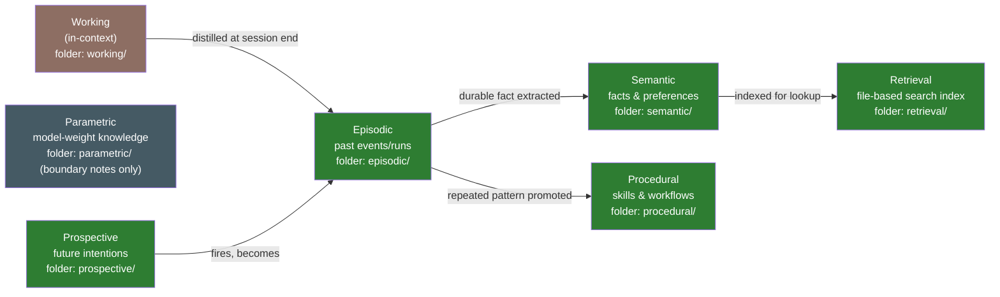

# Agent Memory Knowledge Base

[](https://github.com/jvanheerikhuize/knowledge-base/actions/workflows/kb-lint.yml)

A file-based, infrastructure-free knowledge base built around the [7 types
of agent memory](https://www.marktechpost.com/2026/06/21/the-7-types-of-agent-memory-a-technical-guide-for-ai-engineers/)
(CoALA-derived), following the ingest/wiki/lint maintenance pattern from
[Karpathy's "LLM Wiki" gist](https://gist.github.com/karpathy/442a6bf555914893e9891c11519de94f).
Plain markdown + a stdlib-only Python CLI — no database, no server, no
dependencies.

## The 7 memory types

| Type | Holds | Example |
|------|-------|---------|
| `semantic` | Facts about the world/project | "the KB is file-based, no infra" |
| `episodic` | Records of specific past events | "on 2026-07-22 we migrated X" |
| `procedural` | How-to knowledge, workflows | "how to distill a session into memory" |
| `working` | Short-lived scratch state | current task context |
| `retrieval` | Pointers to external sources | URLs, docs, dashboards |
| `parametric` | Notes on model-internal knowledge | what the agent knows without lookup |
| `prospective` | Future intentions with a `due` date | "rotate the token before 2026-09-01" |

Every entry is one markdown file with YAML frontmatter (name, type,
description, confidence, dates, links). The current contents are always
visible in the published
[memory overview](https://jvanheerikhuize.github.io/knowledge-base/) — index, per-entry pages, and a link graph, rebuilt
on every push that changes memory content.

## Start here

- **Agent entry point:** [`memory/AGENT.md`](memory/AGENT.md) — read this first if
  you're an agent operating on this knowledge base.
- **Design** — see [Architecture](#architecture) and [Design decisions](#design-decisions)
  below for the taxonomy mapping, entry lifecycle, and the rationale behind each
  requirement.

## Layout

```
memory/       the knowledge base itself, one folder per memory type (human-readable)
.kb/          fixed tooling machinery: templates/, schema/, log.md, verdicts.json, golden.json
scripts/      kb.py (CLI), mcp_server.py (MCP over stdio), build_site.py (static overview), serve.py (local editor), scaffold.sh
tests/        stdlib unittest suites for kb.py, mcp_server.py, serve.py, and build_site.py,
              plus test_retrieval_golden.py, which scores retrieval against the real store
.mcp.json     registers the MCP server with any client that reads project config
.github/      CI workflows: lint on change, publish the overview to Pages
site/         generated static overview (git-ignored; built in CI, published to Pages)
```

`memory/` holds only human-readable knowledge — `AGENT.md` plus one folder per
memory type. Everything an editor doesn't need to touch (the entry template, the
JSON Schema, the generated graph/index, the ingest log) lives in `.kb/`. That
directory name is fixed even when the memory folder is scaffolded under a
different name, so the two never get tangled.

## Architecture

```mermaid
flowchart TB
    subgraph Sources["Raw Sources (immutable)"]
        S1[Docs / transcripts]
        S2[Web pages]
        S3[Prior agent sessions]
    end

    subgraph Ingestion["Ingestion Layer"]
        ING["scripts/kb.py new<br/>(agent-assisted classification)"]
    end

    subgraph KB["memory/ — the knowledge base"]
        ENTRY["AGENT.md<br/>(single entry point)"]
        SEM["semantic/"]
        EPI["episodic/"]
        PRO["procedural/"]
        WRK["working/"]
        RET["retrieval/"]
        PAR["parametric/"]
        PRS["prospective/"]
    end

    subgraph Interface["Interaction Interface"]
        CLI["scripts/kb.py<br/>search / context / list / show<br/>new / status / triage / verify<br/>set / link / rm / lint"]
        MCP["scripts/mcp_server.py<br/>MCP over stdio<br/>context / search / get<br/>triage / status / propose_update"]
    end

    subgraph Viz["Overview / Editing"]
        SITE["scripts/build_site.py<br/>static site -> Pages"]
        SERVE["scripts/serve.py<br/>local read/write editor"]
    end

    subgraph Pipeline["Scaffolder / CI"]
        SCAF["scripts/scaffold.sh"]
        GHA[".github/workflows/kb-lint.yml"]
        GHD[".github/workflows/kb-due.yml"]
    end

    Sources --> Ingestion --> KB
    ENTRY -.orients.-> SEM & EPI & PRO & WRK & RET & PAR & PRS
    KB --> CLI
    KB <--> MCP
    KB --> SITE
    KB <--> SERVE
    GHA --> SITE
    GHA --> CLI
    GHD --> CLI
    SCAF -. drops memory/+.kb/+scripts/ into any repo .-> KB
```

### Memory taxonomy → folder mapping

Based on the [CoALA framework](https://arxiv.org/abs/2309.02427) and the
7-types article. Working memory is distilled into durable types before context
is lost; those types feed retrieval; prospective intentions fire into episodes:


```mermaid
flowchart LR
    classDef persisted fill:#2e7d32,color:#fff
    classDef ephemeral fill:#8d6e63,color:#fff
    classDef boundary fill:#455a64,color:#fff

    Working["Working<br/>(in-context)<br/>folder: working/"]:::ephemeral
    Semantic["Semantic<br/>facts & preferences<br/>folder: semantic/"]:::persisted
    Episodic["Episodic<br/>past events/runs<br/>folder: episodic/"]:::persisted
    Procedural["Procedural<br/>skills & workflows<br/>folder: procedural/"]:::persisted
    Retrieval["Retrieval<br/>file-based search index<br/>folder: retrieval/"]:::persisted
    Parametric["Parametric<br/>model-weight knowledge<br/>folder: parametric/ (boundary notes only)"]:::boundary
    Prospective["Prospective<br/>future intentions<br/>folder: prospective/"]:::persisted

    Working -- "distilled at session end" --> Episodic
    Episodic -- "repeated pattern promoted" --> Procedural
    Episodic -- "durable fact extracted" --> Semantic
    Semantic -- "indexed for lookup" --> Retrieval
    Prospective -- "fires, becomes" --> Episodic
```

`working/` never stores raw context (that would defeat the purpose of a context
window); it holds only the *template* an agent uses to distill a session before
it ends. `parametric/` is documentation-only: it records the explicit boundary
of what the KB assumes any capable model already knows, so entries aren't wasted
re-stating common knowledge.

### Entry lifecycle

```mermaid
sequenceDiagram
    participant Agent
    participant KB as memory/&lt;type&gt;/*.md
    participant Lint as kb.py lint
    participant Site as build_site.py

    Agent->>KB: kb.py new --type semantic "fact name"
    Note over KB: writes frontmatter:<br/>confidence, source, last_verified, links
    Agent->>KB: fills in content, sets confidence
    Agent->>Lint: kb.py lint
    Lint-->>Agent: flags stale (>90d unverified),<br/>duplicate slugs, dangling links, schema violations
    Agent->>KB: resolves flags, updates last_verified
    Agent->>KB: kb.py verify / set / link
    Note over KB: mutations recorded in .kb/log.md
    KB->>Site: push to main
    Site-->>Agent: republished overview on Pages
```

## Design decisions

| Requirement | Decision |
|---|---|
| Human readable/editable | Markdown files, YAML frontmatter, no binary formats; machinery kept out of `memory/` in `.kb/` |
| Agent/solution-agnostic single entry point | `memory/AGENT.md` — any agent reads this first, regardless of framework (mirrors the emerging `AGENTS.md` convention) |
| No infra | No DB/vector store. "Retrieval memory" is plain markdown + keyword search over frontmatter, not embeddings |
| Industry-standard alignment | CoALA memory taxonomy + `AGENTS.md` convention + frontmatter style used by Jekyll/Obsidian tooling; maintenance follows Karpathy's LLM-wiki pattern (immutable sources, an incrementally curated linked layer, periodic lint) |
| Ingestion layer | `scripts/kb.py new` scaffolds a typed entry from a template; the operating agent (not a bespoke model call) does the classification, keeping the system model-agnostic |
| Visualization layer | `scripts/build_site.py` renders a Mermaid link graph, colored by memory type, as one page of the published overview — no committed generated files to keep in sync |
| Interaction interface | `scripts/kb.py` CLI: `search`, `context`, `list`, `show`, `new`, `status`, `triage`, `verify`, `set`, `link`, `edit`, `rm`, `lint`; `scripts/serve.py` exposes the same mutations from the browser; `scripts/mcp_server.py` exposes them to any MCP client as tools |
| Agent-native access | MCP over stdio (`scripts/mcp_server.py`), stdlib-only — an agent calls `context`/`search` as tools instead of shelling out to the CLI and parsing printed text. Writes are staged in the working tree, never committed |
| Overview site | `scripts/build_site.py` renders `memory/` into a static, navigable site (type filters, client-side search, per-entry pages with backlinks, graph); published to GitHub Pages on every push that changes memory content |
| Fact-checking / confidence | Every entry carries `confidence` (verified/high/medium/low/unverified) + `last_verified`; `kb.py lint` flags stale entries, duplicate slugs, dangling links, and schema violations |
| Forgetting | Confidence decays one level per 90-day period at read time (never rewriting the file), and `kb.py archive` retires an entry from retrieval while keeping it readable and in the graph — so a store that grows does not drown its current facts in old ones |
| Scaffolding via pipeline/action | `scripts/scaffold.sh` copies `memory/` + `.kb/` + `scripts/` into a target repo; `.github/workflows/kb-lint.yml` shows the CI trigger pattern |

**Deliberate non-goals (v1):** no embeddings/vector search (grep-based
retrieval is the trade-off that keeps "no infra" true); no hardcoded
LLM-driven classification pipeline (ingestion is agent-assisted); no UI *server*
(the overview is statically generated — Mermaid also renders natively in GitHub,
IDEs, and Claude artifacts). No *automatic* contradiction checker, and not for
want of trying — it was measured that no cheap signal separates "these two
entries disagree" from "these two are about the same thing", so contradiction is
a question an agent answers about a blocked pair (`judge --agreement`) rather
than something lint computes.

## CLI quickstart

```
python3 scripts/kb.py list
python3 scripts/kb.py search "<query>" --limit 10   # ranked, best first
python3 scripts/kb.py context "<task>" --budget 2000  # paste-ready context pack
python3 scripts/kb.py new --type semantic "<name>"
python3 scripts/kb.py new --type prospective "<name>" --due 2026-12-31
python3 scripts/kb.py capture --type semantic --name "<slug>" --text "<the claim>"
python3 scripts/kb.py capture --check --text "<the claim>"   # neighbours only
python3 scripts/kb.py lint

python3 scripts/kb.py status           # where every entry stands, and what moves it
python3 scripts/kb.py status --legend  # what each status means and how to leave it
python3 scripts/kb.py triage           # only what needs attention, worst first
python3 scripts/kb.py verify <name> --confidence high
python3 scripts/kb.py archive <name> [--undo]   # retire from retrieval, keep the file
python3 scripts/kb.py dupes [--threshold 0.5]   # near-verbatim pairs (not paraphrases)
python3 scripts/kb.py candidates [-n 3]         # pairs that may restate each other — for you to judge
python3 scripts/kb.py judge <a> <b> distinct --agreement agree   # record both calls at once
python3 scripts/kb.py consolidate [--margin 1.5]  # what those verdicts still owe — proposals only
python3 scripts/kb.py history <name>   # what it used to say — corrections here are made in place
python3 scripts/kb.py stats            # counts, graph density, age, growth — the store in aggregate
python3 scripts/kb.py eval [--all] [--budget N]  # score retrieval against the golden query set
python3 scripts/kb.py set <name> description "a better summary"
python3 scripts/kb.py link <name> <target> [--remove]
python3 scripts/kb.py edit <name>      # opens $EDITOR
python3 scripts/kb.py rm <name> [--force]

python3 scripts/build_site.py          # renders the overview into site/
python3 scripts/serve.py               # same site, locally, with editing on
```

`kb.py search` ranks with BM25 over the whole store rather than reporting
substring hits in file order, and the ranking knows what kind of store this
is: a term in an entry's name weighs more than one in its body, memory type
sets a prior (a procedure answers a task better than a scratch file),
recency applies to `episodic` entries only — a log decays, a fact does not —
and confidence nudges near-ties. `kb.py context "<task>"` wraps the same
ranking into a paste-ready brief, trimmed to a token budget, every entry
carrying its confidence, verification date, and source path so nothing
enters an agent's context unattributed.

`kb.py lint` enforces the frontmatter schema, catches duplicate slugs and
dangling links, and warns on stale, unverified, orphaned, or overdue
entries (`--strict` turns warnings fatal; CI runs that weekly).

## Adding a claim: `capture`

`kb.py capture` files a claim **you have written** and runs the restatement
check first — which existing entries does this read like? It takes the passage
from `--text`, a file, or stdin; `--check` reports and writes nothing,
`--type` with `--name` files it as `confidence: unverified`, and
`--extend <name>` appends it to the entry that already holds the claim rather
than adding a near-twin. The same three modes exist as an MCP tool.

There is deliberately **no `distill <transcript>`**. It was measured before it
was built and there is nothing in a transcript to extract: an entry's one-line
claim is not recoverable even from its own body (1 of 30 entries), a real
Claude Code transcript is 85% tool traffic with its `thinking` blocks
persisted encrypted, and the agent that would run it is the one that still has
the session in context. The claim is synthesised when it is written — so the
tool checks what you wrote instead of pretending to write it
([[kb-capture-is-a-check-not-an-extractor]], ROADMAP Phase 6).

Two measured numbers set its behaviour, both reusing constants that were
already in the codebase: the top-ranked neighbour of a true restatement is the
right entry 30 of 30 times (and the existing `RESTATEMENT_MARGIN` of 1.5 fires
on 29 of those, never wrongly), and the top-ranked neighbour of an entry's body
is a link its author actually drew 70% of the time — which is why exactly one
link is prefilled and the rest are printed for you to choose.

## Measuring retrieval

`kb.py eval` scores the ranker against `.kb/golden.json` — a fixed set of
task-shaped questions with the entry each one should return — and reports
`success@1`, MRR, and recall@3/@5. `tests/test_retrieval_golden.py` runs the
same set against the real store in CI, so retrieval getting worse is a failing
test rather than a feeling.

It also reports **`recall@pack`**, which is a different question and not a
synonym for `recall@5`. The four numbers above ask where the *ranker* put an
entry; `kb.py context` is bounded by a **token budget**, so what it returns
depends on how long entries are. Measured 2026-08-10: the default pack held
5.14 entries on 2026-07-27 and 2.75 on 2026-08-09, purely because entries got
longer — and no rank metric moved, because none of them has a budget term.
`kb.py eval --budget N` scores the pack at any budget; the rank numbers will
not move with it, and that is the point (ROADMAP Phase 13).

Two things about that set are load-bearing, and both were measured rather than
assumed (ROADMAP Phase 7):

- **The queries must not reuse the entry's own words.** Queries generated from
  entry titles or descriptions — the obvious way to build a golden set — score
  a perfect 1.000 against *every* ranker measured here, including one that
  never reads an entry body. Such a set cannot fail, so it tests nothing. The
  wording is the whole fixture, and a test asserts the queries stay that way.
- **The set detects breakage, not tuning.** At this store size, removing IDF,
  flattening the field weights, or dropping the type/confidence/recency signals
  all land inside the noise band (paired bootstrap, 95% CI spanning zero).
  Removing the entry bodies does not. So the thresholds in the test are floors
  well below today's scores, and no tuned constant is asserted anywhere.

`kb.py stats` is the other half: what the store is made of rather than what it
answers — counts by type and confidence (as written and as read today, after
decay), link density, orphan and unlinked counts, median age, and growth by
month. The same block ships in the site's `data.json`.

## Forgetting

A memory store does not fail by losing facts. It fails by keeping all of them,
until stale claims outrank current ones and an agent that remembers everything
remembers nothing useful. Two mechanisms push back, and neither one rewrites
what an author wrote.

**Confidence decays with age.** `confidence` records how well a fact was checked
*when it was checked*; on its own it says nothing about how long ago that was.
So ranking uses an aged value — one level down per 90-day staleness period, so
a `verified` fact untouched for a year is not verified. The decay is computed at
read time and reversed by `kb.py verify`; the file on disk keeps the level its
author recorded. Where both numbers matter, both are shown:

```
1.  4.21  [semantic   ] some-fact  [verified -> medium, aged]
```

Context packs carry it into an agent's context the same way —
`confidence: medium (recorded as verified, aged)` — because a claim's age is
part of its provenance, not a detail to quietly drop.

**Archiving retires without destroying.** `kb.py archive <name>` stamps an
`archived` date. The entry leaves the retrieval set — searches, context packs,
and the triage queue all skip it — but the file stays, the links stay, and it
stays in the graph, so the record of what was once believed survives. `status`
still accounts for it, under its own `archived` state. `--undo` reverses it, and
`rm` is still there for the cases where an entry should genuinely be gone.

The distinction matters: deleting an entry destroys the evidence that anyone
ever thought it. Archiving is the operation you want almost every time.

## Duplicates, and the honest limit on finding them

```
python3 scripts/kb.py dupes [--threshold 0.5]
```

`dupes` finds **text recorded twice** — an entry added twice, a scaffolded copy
drifting back in, an agent re-recording its own work. It reports Jaccard over
5-word shingles *and* containment, because they answer different questions:
Jaccard asks "are these the same entry twice", containment asks "is the smaller
one already wholly inside the larger", which is the superseded-entry case
Jaccard scores lowest exactly when the sizes differ most. Entries with fewer
than 20 shingles are named as too short to judge rather than silently skipped.

**It does not find two entries making the same claim in different words**, and
that is measured, not assumed. A hand-written paraphrase of an existing entry
ranked **#14 of 210 pairs** by token Jaccard and **#16** by tf-idf cosine —
below thirteen pairs of entries that merely share a subject. On raw 5-word
shingles it scored 0.000, against a whole-store maximum of 0.007.

The reason is structural: shingling detects copy-paste, and hand-written prose
about related topics shares vocabulary without sharing phrasing. Every lexical
metric therefore ranks *topical neighbours* above *actual restatements*. Any
threshold low enough to catch a paraphrase admits a dozen false positives first,
and a tool whose top hits are all wrong is one people learn to ignore.

So the default sits at ~70× the observed maximum, the command prints the
sentence naming its own limit, and a clean result means *no copies found* —
never *no duplicates*. Full write-up in the `kb-duplicate-detection-limits`
entry; `TestDupes.test_a_paraphrase_is_not_flagged` pins it as a regression test,
so lowering the threshold to "catch more" fails loudly.

One deliberate consequence: entries still holding the unfilled template body are
identical to each other, so `dupes` flags them. That is a feature — it surfaces
scaffolding nobody came back to finish.

MinHash and LSH were considered and rejected: they approximate Jaccard to make
O(n²) tractable at web scale, and this store is a few dozen files where the exact
computation is free and an approximation would only add error.

## The same claim in different words: `candidates` and `judge`

```
python3 scripts/kb.py candidates [-n 3] [--all]
python3 scripts/kb.py judge <a> <b> duplicate|overlap|distinct \
        --agreement agree|contradict [--note "..."]
```

The paragraphs above say lexical similarity cannot *decide* whether two entries
make the same claim. That stands. What was wrong was the framing, and measuring
it again with the framing changed is what unblocked this.

A global threshold asks "is this pair similar in absolute terms" — and absolute
similarity is dominated by how much vocabulary a *topic* happens to share, which
varies far more between topics than duplication does within one. Asking instead
"of everything in the store, which entries is this one **most** like" cancels
that per-entry baseline out. Measured over seven hand-written paraphrases
planted in this store (28 entries, 378 pairs):

| framing | result |
|---|---|
| global ranking, best pairs first | worst planted paraphrase at **#81 of 378** |
| each entry's single nearest neighbour, unioned both ways | **7 of 7** caught, in **19 pairs** (5% of the space) |

The union matters and is not a detail: a long entry's nearest neighbour is often
not the short entry restating it, while the short one's nearest neighbour is
reliably the long one. Taking a pair when *either* side nominates it is what
turned 6 of 7 into 7 of 7 at no extra cost.

So `candidates` is a **blocker** — the cheap, recall-oriented half of the
standard record-linkage pair — and it stops there. It never calls a pair a
duplicate; roughly one candidate in three to eight is a real restatement and no
score tells you which. Deciding is a judgement someone makes by reading both
entries, which is the same division of labour as `kb.py new`: the tool does the
mechanics, the operating agent supplies the classification, and no vendor model
is wired into the store.

**`judge` writes that decision down**, in `.kb/verdicts.json`, so it outlives one
agent's context and nobody re-reads the pair:

- `duplicate` — the same claim twice. Stays in the queue until it is merged,
  because that is outstanding work, not a closed question.
- `overlap` — related, both earn their place. Link them.
- `distinct` — different claims that share vocabulary. Leaves the queue.

A verdict is bound to a digest of the two entries' description and body, and to
nothing else. Re-verify an entry or relink it and the verdict stands, because
neither changes what it *claims*; rewrite the body and the pair comes back marked
`TEXT CHANGED SINCE`. That is what makes the pass incremental: the first sweep of
this store cost 42 judgements, and a new entry costs about `n` more, not another
sweep of the whole square.

Default `-n 3` rather than the measured-sufficient `-n 1`: recall was already 7/7
at one neighbour, but two of the seven cleared their nearest rival by under 0.02,
and seven positives is too small a sample to spend that margin on.

## The other question about the same pair: `--agreement`

`memory/AGENT.md` carried a standing admission — lint "does not detect
content-level contradictions between entries — no such checker exists yet." It
still does not detect them. What changed is that the sentence now says why.

Nine contradictions were planted in a copy of this store to find out what a
detector would have to look like: eight hand-written (a capability flipped, a
count changed, two documents each claiming authority, a mechanism described
backwards) and one real, recovered from git — the pre-correction
`kb-duplicate-detection-limits` against the entry that overturned it.

| signal | pairs it puts up | contradictions caught |
|---|---|---|
| global topical similarity | positives at **#2 to #107** of 435 | no usable cut |
| claim-level sentence alignment | 10 pairs (2% of the space) | 4 of 9 |
| negation-polarity mismatch | 12 pairs (3%) | 5 of 9 |
| **the `candidates` blocker above, `-n 3`** | 62 pairs (14%) | **8 of 9** |
| the `candidates` blocker above, `-n 5` | 103 pairs (24%) | **9 of 9** |

Polarity mismatch fails in the way that settles the question: it cannot see
two competing *positive* assertions at all — "20 repos" against "22 repos" —
which is the commonest shape a disagreement takes. Its false positives are
negation-scope errors ("this is **not** just a preference" is agreement) and
entries that agree *about* a contradiction located somewhere else.

So there is no detector, and none is needed. The blocker built for duplicates
already surfaces these pairs; what was missing was a way to *say* it.
`duplicate|overlap|distinct` answers how much two entries say the same thing
and has no value meaning "they disagree", so a pair could be judged, look
settled, and never have been asked. `--agreement` is that second axis:

- `agree` — both can be true. Settles the pair.
- `contradict` — they cannot. Both entries go to the `contradicted` status and
  the pair stays in the queue until somebody reconciles them.
- *omitted* — nobody looked. Stored as an **absent key**, not a default, so the
  46 verdicts written before this axis existed read as unexamined rather than
  as fine, and came back marked "never checked for contradiction".

Contradiction is deliberately not a lint failure: lint checks form, and whether
two claims can both be true is not form. It is a triage reason and a status,
sitting above `broken` — every other status means nobody has checked; this one
means somebody checked and the store is wrong.

Contradiction is a *sub-claim* relation where duplication is a *whole-entry*
one — one line inside a long entry against one line inside another — which is
why full recall wants `-n 5` (24% of the pair space) where 5% sufficed for
paraphrases. The one positive missed at `-n 3` was exactly that: a short claim
against one line of a long episodic sweep.

**First full pass, 2026-07-30: 75 pairs at `-n 5`, one real contradiction.**
`kb-entry-status-model` said every entry sits in one of *eight* statuses and
omitted `archived`; `kb-forgetting-model` said archiving gives an entry its own
`archived` state on the board. It had stood for two days, through a full
duplicate-judging pass, a clean lint, and a clean triage, because nothing had
ever asked. The same 45 pairs read for duplicates the day before had returned
zero duplicates — asked the second question, they returned a real defect.

`kb.py status` answers the complementary question. Where `triage` lists only
what is already wrong, `status` places *every* entry in exactly one of ten
states — `contradicted`, `broken`, `overdue`, `stale`, `unverified`,
`provisional`, `isolated`, `ageing`, `current`, `archived` — worst first, each
carrying the literal command that moves
it out, plus a `review_by` date (`last_verified` + 90 days). That is what stops
"clean" from quietly meaning "unexamined". The full table lives in
[`memory/AGENT.md`](memory/AGENT.md#entry-status).

## MCP server

```
python3 scripts/mcp_server.py [--read-only]
```

The same store, served to any MCP client over stdio so an agent calls it as a
tool instead of shelling out to the CLI and parsing printed text. Stdlib-only,
no process to keep running — the client spawns it.

| Tool | What it does |
|---|---|
| `context` | the budgeted, provenance-carrying brief for a task — the one call to make at the start of a task |
| `search` | BM25 hits, best first, with the same type/recency/confidence weighting as the CLI |
| `get` | one entry in full: raw markdown plus parsed frontmatter |
| `history` | what an entry used to say and which revision changed it — the superseded wording is nowhere else, since entries are corrected in place |
| `triage` | the queue of entries that are wrong or ageing, worst first |
| `status` | every entry in exactly one status, with the command that moves it |
| `dupes` | entry pairs whose text overlaps near-verbatim — copies, not paraphrases |
| `duplicate_candidates` | each entry's nearest neighbours, as a short list of pairs for the agent to judge by reading them — the contradiction check runs over the same list |
| `judge` | record both answers about a pair: how much it overlaps, and whether the two disagree — staged, never committed |
| `propose_update` | stage an edit to an entry in the working tree — **never commits**; also archives and un-archives |
| `capture` | check a claim you have written against the store, then file it as a staged `unverified` entry or append it to the entry that already holds it |

Entries are also published as MCP *resources* (`kb://entry/<name>`, plus
`kb://agent` for the entry-point doc), so a client can attach one directly
rather than going through a tool call.

**Writes are proposals.** `propose_update` and `capture` edit the working tree
and stop there. Git stays the review gate and the only durable write path,
exactly as `serve.py` settled it for the browser — an agent can suggest a
change, a human reads `git diff` and commits it. `--read-only` drops both tools
from `tools/list` entirely, which is the right mode when the client is not
yours.

**Protocol.** Speaks MCP `2025-11-25` and negotiates down to `2025-06-18` or
`2025-03-26`. It does **not** implement `2026-07-28`: that revision removes the
initialize handshake in favour of per-request `_meta`, is a documented breaking
change with no automatic compatibility, and was published the same day this
server was written — nothing that would connect to it speaks that version yet.
Revisit when the SDKs land (ROADMAP Phase 2).

`.mcp.json` in the repo root registers the server, so a client that reads
project-scoped MCP config picks it up with no setup. Registering it by hand:

```json
{"mcpServers": {"knowledge-base": {"command": "python3",
                                   "args": ["/abs/path/to/scripts/mcp_server.py"]}}}
```

## Overview site

`scripts/build_site.py` renders `memory/` into a static site under `site/`:

- an index of every entry with per-type filters and instant client-side
  search; the search box and type filter sync to `?q=`/`?type=` in the URL, so
  a search is a link you can share or bookmark
- one page per entry with its frontmatter, rendered body, resolved
  `[[wikilinks]]`, outgoing links, and backlinks
- a status board (`status.html`) placing every entry in exactly one status,
  with the legend and the command that moves it
- a timeline (`timeline.html`): growth by creation month as bars, a type ×
  status heat map so decay concentration is visible at a glance, and every
  creation/re-verification event newest first — built from frontmatter dates
  only, since the Pages checkout is depth-1 and a git-derived timeline would
  be silently wrong
- a Mermaid graph page and a memory-type reference page
- `site/data.json` — every entry as structured data, including bodies,
  links, backlinks, and both the as-written and as-read confidence; also the
  portable bundle another repo reads (contract below)

`data.json` is the interactivity hook: anything richer than filter-and-search
(timelines, graph exploration, an edit surface) can be built against it without
changing the builder. The site is stdlib-generated, self-contained apart from
the Mermaid script on the graph page, and never committed — `site/` is
git-ignored and built fresh in CI.

**Publishing.** `.github/workflows/pages.yml` rebuilds and deploys to GitHub
Pages on every push to `main` that touches `memory/**`, `.kb/**`,
`scripts/kb.py`, or the builder itself. Pushes that change only docs, tests, or
unrelated tooling do not trigger a rebuild, so a deploy always means the memory
itself moved. The workflow lints before it builds: a schema-invalid KB fails
rather than publishing. Pages must be enabled once for the repository with
**Settings → Pages → Source: GitHub Actions**.

### Reading this store from somewhere else: the `data.json` contract

`data.json` is also the portable bundle — the supported way for another repo,
a CI job, or a browser to read this store **without importing the tooling**.
It is one published file, ~145 KB for 32 entries, no API key and no service
behind it. Two ways in, and which one you get depends on where you are:

- **Same disk** (a sibling checkout, a local agent): mount the MCP server by
  absolute path — `python3 /abs/path/to/scripts/mcp_server.py --read-only`.
  Every script resolves the store from its own location, not the working
  directory, so this works from any cwd and you get ranked retrieval, not
  just the raw entries.
- **Anywhere else**: fetch `data.json` from the published site.

What the bundle promises:

- `schema_version` — an integer, bumped whenever a key is added, dropped,
  renamed, or given a different meaning. A contract test in
  `tests/test_build_site.py` pins the exact key set of the bundle and of each
  entry, so the shape cannot change without someone deciding to bump it.
- `entries[]` — every entry in full: frontmatter, `body`, resolved `links`,
  computed `backlinks`, `status`, and its `path` in this repo.
- **Two confidence fields, and the difference matters.** `confidence` is what
  the author wrote when they last checked the claim; `effective_confidence`
  (with `decayed_by`) is what the store *reads* it as today, after staleness
  decay. Trust the second one. A consumer that reads `confidence` because it
  is the obvious field gets exactly the number the decay model exists to
  correct — and this store was written in a single sprint, so it does not
  drift entry by entry: nothing diverges before 2026-11-02 and everything
  diverges on it.
- `stale_days` and `confidence_levels` — the decay rule itself, not just its
  result. A bundle is read long after `generated`, so recompute from
  `last_verified` rather than trusting a derived field that has since aged.
- `status_model`, `status[]`, `triage`, `stats` — the same reports `kb.py
  status`, `kb.py triage`, and `kb.py stats` print.

Entry `name`s are the join key and are treated as stable: no entry has ever
been renamed or deleted in this store's history. Nothing else is promised —
in particular, an entry's `body` is markdown that may change wording at any
time, and `[[wikilinks]]` inside it resolve only against names in the same
bundle.

## Tests

```
python3 -m unittest discover tests
```

## Scaffolding into another repo

```
scripts/scaffold.sh /path/to/target-repo [subfolder-name]
```

Copies `memory/`, `.kb/`, `scripts/kb.py`, `scripts/mcp_server.py`, and the CI
workflow into the target repo. Solution- and agent-agnostic — no dependency on
this repo at runtime. The site builder and local editor are deliberately not
copied; the CLI and the MCP server are, because those are the two ways an agent
actually uses the store. Register the server in the target repo's `.mcp.json`
to turn it on.

### Keeping a scaffolded copy in sync

`scaffold.sh` copies files once; it does not link the target repo back to this
one, so fixes made here (e.g. a `kb.py` lint bug) don't propagate
automatically. Pick whichever of these fits the target repo:

- **Add this repo as a remote, then selectively check out updated files:**

  ```bash
  git remote add kb-upstream <this-repo-url>
  git fetch kb-upstream
  git diff HEAD kb-upstream/main -- scripts/kb.py
  git checkout kb-upstream/main -- scripts/kb.py
  ```

- **One-off file copy**, if you don't want a permanent remote:

  ```bash
  curl -fsSL <raw-url>/scripts/kb.py -o scripts/kb.py
  ```

- **Automate it** with a scheduled workflow (e.g.
  [`actions-template-sync`](https://github.com/AndreasAugustin/actions-template-sync))
  that opens a PR whenever `scripts/kb.py` changes
  upstream, if the target repo wants sync without a manual check-in.

The machinery is what's meant to be pulled verbatim — `scripts/kb.py`,
`scripts/build_site.py`, and the `.kb/templates`/`.kb/schema` definitions. The
`memory/` contents, `.kb/log.md`, and `.kb-config` are the target repo's own
data and shouldn't be overwritten by a sync.

Nothing generated is committed, so a sync never leaves stale build output
behind — the overview is rebuilt from `memory/` on demand.

### Relationship to other AI-context systems

Some repos already have a broader AI-assistant context system (ADRs,
authorization policies, request-to-code traceability, architecture docs —
often under something like `.ai/`). This knowledge base is not a replacement
for that: it covers one narrower concern, an agent's own cross-session
*memory* (facts, procedures, past episodes), organized by the 7-type
taxonomy above. A project-governance system and this KB can and should
coexist — see [dotfiles](https://github.com/jvanheerikhuize/dotfiles)'s
`.ai/` (governance) alongside its scaffolded `memory/` (this KB) for an
example of the split.

## Original goal

<details>
<summary>The requirements this repo was built from</summary>

**Goal:** create a persistent file-based knowledge base around the 7 types
of agent memory.

**Requirements:**

- readable and editable by humans
- scaffolds into a system readable by any agent; the scaffolder can be
  triggered via a pipeline/action
- file based, no infra needed
- closest to current industry standards
- lives in a subfolder of a repository
- has a single point of entry for an agent
- solution & agent agnostic
- needs an ingestion layer
- needs a visualisation layer
- needs an interface to interact with the knowledge base
- fact checking and confidence scoring

**Sources:**

- <https://www.marktechpost.com/2026/06/21/the-7-types-of-agent-memory-a-technical-guide-for-ai-engineers/>
- <https://gist.github.com/karpathy/442a6bf555914893e9891c11519de94f>

</details>

## License

[MIT](LICENSE)

## Roadmap

See [ROADMAP.md](ROADMAP.md). In short: formation is done (templates, schema
lint, staleness audits, the published site), so the work ahead is in the two
harder stages of the memory lifecycle — **evolution** (ranked retrieval,
consolidation, decay, temporal validity) and **exposure** (an MCP server so
agents can query the store as a tool rather than shelling out).

---
