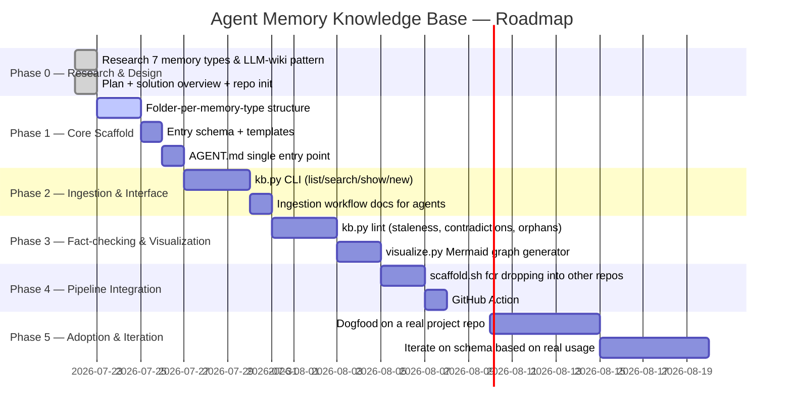

# Roadmap

## Phase details

**Phase 0 — Research & Design (done, this session)**
Reviewed the CoALA-derived 7-memory-type taxonomy and Karpathy's LLM-wiki
maintenance pattern; produced `docs/plan.md` and
`docs/solution-overview.md`; initialized this repo.

**Phase 1 — Core Scaffold**
Stand up `memory/<type>/` folders, a JSON Schema for entry frontmatter, a
markdown template, and `memory/AGENT.md` as the single entry point. Delivered
in this same session alongside the docs.

**Phase 2 — Ingestion & Interface**
`scripts/kb.py` gains `new` (scaffold a typed entry), `list`, and `search`
(keyword/frontmatter grep — no embeddings). Ingestion stays agent-assisted:
the operating agent reads a source, classifies it into one of the 7 types,
and runs `kb.py new` to scaffold the file rather than a hardcoded model call
doing it — this is what keeps the system solution-agnostic.

**Phase 3 — Fact-checking & Visualization**
`kb.py lint` flags entries whose `last_verified` is stale past a threshold,
duplicate/contradicting `name` slugs with conflicting content, and
`links:` pointing at entries that don't exist. `scripts/visualize.py` walks
all frontmatter and regenerates `memory/_generated/graph.mmd`, a Mermaid
graph colored by memory type and confidence.

**Phase 4 — Pipeline Integration**
`scripts/scaffold.sh` copies the `memory/` + `scripts/` template into any
target repo as a subfolder (satisfies "scaffolder can be triggered via a
pipeline/action"). `.github/workflows/kb-lint.yml` runs `kb.py lint` and
regenerates the graph on every PR touching `memory/**`.

**Phase 5 — Adoption & Iteration**
Use the scaffold on a real working repo, capture friction, and adjust the
schema/CLI. Candidate upgrades (deliberately deferred, not required for v1):
- Optional embedding-based retrieval as a pluggable backend behind the same
  `kb.py search` interface, for repos that *do* want infra.
- A lightweight read-only HTML viewer for the Mermaid graph (still no
  server — a static file).
- MCP server wrapper exposing `kb.py` commands as tools, for agents that
  prefer MCP over shelling out.
