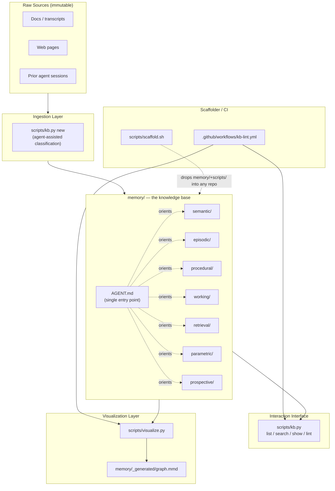
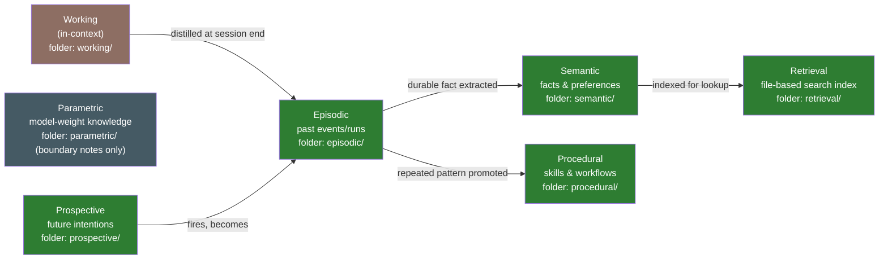
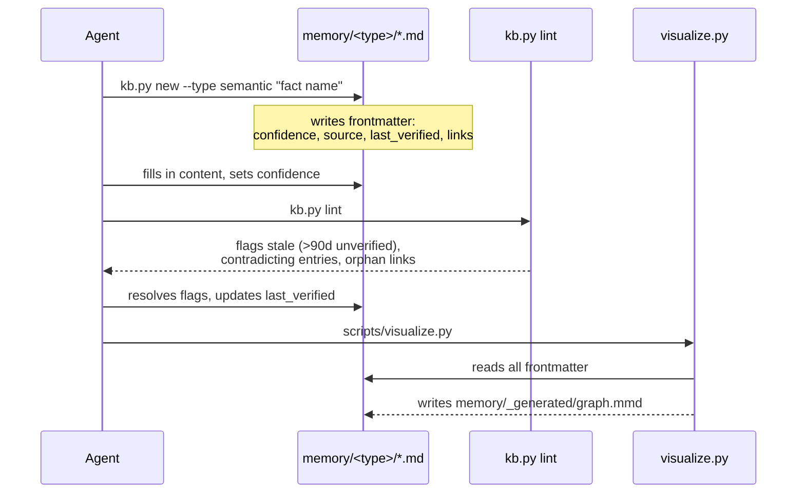

# Solution Overview

## System at a glance



## Memory taxonomy → folder mapping

Based on the CoALA framework and the 7-types article:



`working/` never stores raw context (that would defeat the purpose of a
context window); it holds only the *template* an agent uses to distill a
session before it ends. `parametric/` is documentation-only: it records the
explicit boundary of what the KB assumes any capable model already knows,
so entries aren't wasted re-stating common knowledge.

## Entry lifecycle (ingestion → fact-check → visualization)



## Entry format (all memory types share this shape)

```yaml
---
name: kebab-case-slug
type: semantic|episodic|procedural|working|retrieval|prospective
description: one-line summary
confidence: verified|high|medium|low|unverified
source: where this came from (URL, session, person)
created: YYYY-MM-DD
last_verified: YYYY-MM-DD
links: [other-entry-slug, ...]
---

Body content in markdown.
```

This is deliberately close to the frontmatter convention already used by
static-site generators (Jekyll/Hugo) and note-taking tools (Obsidian) —
familiar to humans, trivially parsable by any agent, and requires no schema
server to validate (a plain JSON Schema file is provided for optional
local validation).

## Single point of entry

`memory/AGENT.md` is the one file every agent reads first. It explains:
- the folder-per-memory-type layout and when to use each
- the confidence-scoring rubric
- how to add an entry (`kb.py new`), search (`kb.py search`), and audit
  (`kb.py lint`)
- links to `docs/plan.md` and `docs/roadmap.md` for the "why"

This mirrors the emerging `AGENTS.md` convention and Karpathy's schema
document pattern, kept solution-agnostic — nothing in it assumes a
particular agent framework or model provider.
